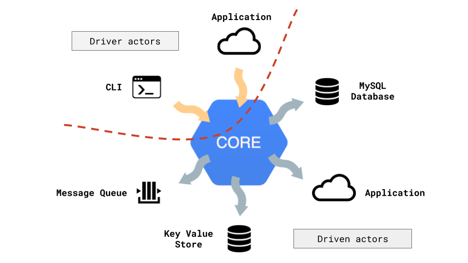

# nestJS Hexagonal Architecture example

## What is Hexagonal Architecture

### Concepts

**Core:** _The core could be viewed as a “box” capable of resolve all the business logic independently of the infrastructure in which the application is mounted_

**Drivers (or primary) actors:** _are those who trigger the communication with the core. ._

**Driven (or secondary) actors:** _are those who are expecting the core to be the one who trigger the communication._

**Ports:** _In one hand, we have the ports which are interfaces that define how the communication between an actor and the core has to be done_

**Adapters:** _In the other hand, we have the adapters that are responsible of the transformation between a request from the actor to the core, and vice versa_



[Original Article](https://medium.com/@matiasvarela/hexagonal-architecture-in-go-cfd4e436faa3)

## Project structure

```bash
src/internal/core - all the business logic (domain objects, interfaces and use cases)

src/internal/handlers - incoming requests. usually http layer and authentication

src/internal/repositories - adapters used by the core logic, i.e to access a Database

```

## To Do

- [] Tests
- [] Makefile
